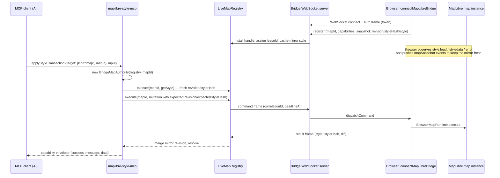

# How MCP Accesses a Running MapLibre Map

This document explains the runtime path from an MCP tool call to a live
MapLibre map instance in a browser, as implemented by the unified capability
layer and the browser bridge (bridge protocol v2).

**The key idea:** the MCP server never holds a MapLibre map. Instead, the
browser page that owns the map dials *into* a WebSocket bridge embedded in the
MCP process and registers the map. MCP capability tools then address the map by
`mapId` through the bridge registry, which forwards command frames to the
browser for execution against the real map.

## 1. MCP process startup — `src/mcp/main.ts`

`runExecutable` starts the bridge before the MCP transport:

1. `createBridgeServer(parsed.bridge)` (`src/bridge/server.ts`) binds the
   loopback WebSocket endpoint configured by `--bridge-host`, `--bridge-port`,
   `--bridge-token`, and `--bridge-origin`.
2. The bridge server owns a `LiveMapRegistry` (`src/bridge/registry.ts`).
3. `createLiveMapMcpExtension(bridge.registry)` (`src/mcp/live-extension.ts`)
   injects the registry into the MCP server via the extension context and
   registers three live resources:

   | Resource | URI | Backed by |
   |---|---|---|
   | Map collection | `maplibre-style://maps` | `registry.projectList` |
   | Map metadata | `maplibre-style://maps/~{mapId}` | `registry.projectMetadata` |
   | Map style | `maplibre-style://maps/~{mapId}/style` | `registry.projectCachedStyle`, falling back to `registry.execute(mapId, {type:'getStyle'})` with per-map request dedup |

   Style resource reads require the map's `style.read` capability and a `known`
   sync state; failures surface as `CAPABILITY_DENIED`, `MAP_NOT_READY`, or
   `BRIDGE_DISCONNECTED`.

## 2. Browser connection — `src/bridge/client.ts`

The page calls `connectMapLibreBridge(map, options)` with the real map
instance, `url`, `token`, `mapId`, `capabilities`, and a resource URL policy.
The handshake then runs per WebSocket generation:

1. **Authenticate** — the token is sent in the first frame, never in the URL.
2. **Wrap the map** — `createBrowserMapRuntime(map, …)`
   (`src/bridge/browser-runtime.ts`) creates the executor that applies bridge
   commands to the real map.
3. **Register** — a register frame carries `mapId`, capabilities, negotiated
   limits, and a snapshot (`revision`, `styleHash`, optionally the full
   style). The registry validates the snapshot hash, installs a handle, and
   returns a `leaseId`.

After registration, the client observes `style.load`, `styledata`, and `error`
on the map. External edits trigger `externalStyleChange` / `mapSnapshot`
events, and sync-loss triggers `mapStatus: unknown` followed by a fresh
snapshot — so the registry mirror (revision, styleHash, cached style) always
converges back to the real map. Registration replay and lease replacement
handle reconnects without duplicate owners.

## 3. Bridge registry — `src/bridge/registry.ts`

`LiveMapRegistry` holds one handle per `mapId`: peer socket, `leaseId`,
capabilities, negotiated limits, mirror `revision`/`styleHash`, and a
`cachedStyle` when the snapshot carried a style.

`registry.execute(mapId, command, timeoutMs?)` is the single egress path:

- Parses and validates the command, asserts the map granted the required
  capability (`assertCapability`), enforces the negotiated operation limit and
  frame-size limit.
- Builds a `BridgeCommandFrame` with a fresh `correlationId` and `deadlineAt`,
  queues it per map, and pumps it over the peer's WebSocket.
- `acceptResult(peerId, frame)` validates the correlation, protocol shape, and
  capability rules; on success it merges the returned snapshot into the mirror
  and resolves the pending caller. Protocol violations close the handle.
- `disconnect(peerId)` rejects all outstanding work with
  `BRIDGE_DISCONNECTED`.

## 4. Tool routing — `src/mcp/tool-handlers.ts`

All five capability tools (`inspectStyle`, `applyStyleTransaction`,
`applyStyleDocument`, `runMapCommand`, `queryMapFeatures`) accept a strict
`{target, input}` envelope and delegate to
`capabilityRegistry[name].execute(authorityFactory, input)`:

| `target` | Authority | Touches a live map? |
|---|---|---|
| `{kind:"map", mapId}` | `BridgeMapAuthority(registry, mapId)` | Yes — bridge commands |
| `{kind:"session", sessionId, expectedRevision?}` | `SessionStyleAuthority(store, …)` | No — offline document session |
| omitted | `null` | No — only the authority-free inspect actions (`validateDocument`, `validateTransaction`, `analyzeGeoJson`) |

`runMapCommand` and `queryMapFeatures` require a map target; session targets
are rejected for them.

## 5. Live mutation consistency — `src/mcp/bridge-authority.ts`

`BridgeMapAuthority` implements both `StyleAuthority` and `RuntimeAuthority`
over one live map:

- **Reads** use `registry.projectCachedStyle` (mirror-first).
- **Mutations** (`applyStyleTransaction`, `applyStyleDocument`) first issue a
  fresh `getStyle` to obtain the current `revision`/`styleHash`, project the
  transaction locally (pre-operation validation), then send the mutation with
  `expectedRevision`/`expectedStyleHash` — optimistic concurrency owned by the
  authority, so callers never supply revision state. A stale map yields
  `REVISION_CONFLICT`; the browser result must be a full transaction result,
  and a requested-but-omitted diff fails honestly instead of fabricating an
  empty one.
- **Runtime commands** (`runMapCommand`, `queryMapFeatures`) map to bridge
  command frames. Commands the bridge protocol does not support —
  whole-document apply, `updateGeoJsonData`, tile LOD params, sprites,
  `addImageFromUrl` — return explicit `CAPABILITY_DENIED` failures.
- Errors from the browser keep their authentic codes via `isStyleToolError`;
  they are never laundered to `INTERNAL` by `instanceof` checks.

Stable live failure codes: `BRIDGE_DISCONNECTED`, `CAPABILITY_DENIED`,
`MAP_NOT_READY`, `TIMEOUT`, `REVISION_CONFLICT`.

## 6. Capability gating

The browser declares its capabilities at registration (`style.read`,
`style.write`, `features.query`, `runtime.state`, `assets.write`,
`network.load`). The registry asserts them per command on every `execute`, and
the browser re-enforces them per dispatch — full MCP live-map parity requires
all six. Session targets are unaffected; they remain offline document
workflows.

## File map

| Role | File |
|---|---|
| Process wiring, CLI flags | `src/mcp/main.ts` |
| Tool routing `{target, input}` | `src/mcp/tool-handlers.ts` |
| Live authority over one map | `src/mcp/bridge-authority.ts` |
| Session (offline) authority | `src/mcp/session-authority.ts` |
| Live MCP resources | `src/mcp/live-resources.ts`, `src/mcp/live-extension.ts` |
| Bridge WebSocket server | `src/bridge/server.ts` |
| Map registry / command egress | `src/bridge/registry.ts` |
| Browser bridge client | `src/bridge/client.ts` |
| Real-map executor in browser | `src/bridge/browser-runtime.ts` |
| Capability registry/executors | `src/capabilities/registry.ts` |
| Browser embedding example | `examples/browser-bridge/` |
